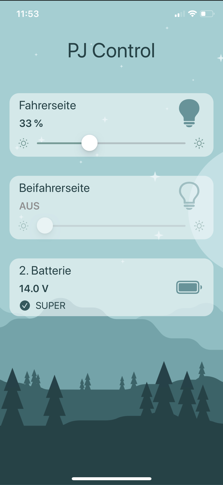

# PJ Control App
PJ Control is an app which can
 * dimm led spotlights
 * read voltage of a camper vans battery

The app interacts with [PJ Control Thing](https://github.com/kramerjul/pj-control-thing) via Bluetooth LE.

## Design

